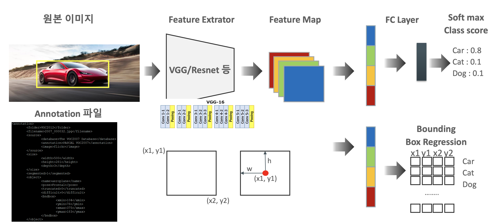
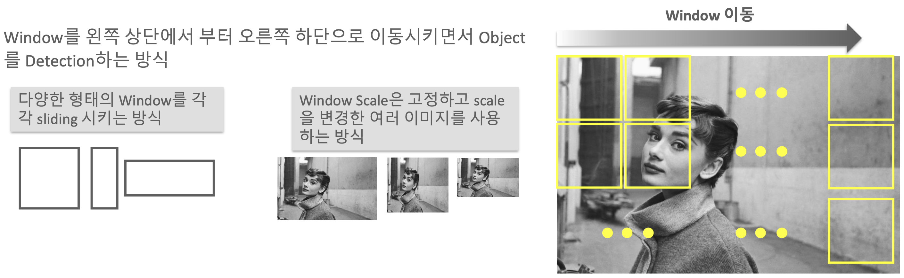

## 0. Dependancy

-   CNN
-   feature extractor network(convolution, kernel(filter), pooling, feature map)
-   VGG, rasnet etc

---

- 2012년도에 AlexNet이 ImageNet compatition에서 DL기반의 CNN을 사용
- 이 시점을 기준으로 DL에 대한 performance 등 여러 가능성이 증가함

  

## 1. Definition

 

#### Classification

- feature map과 label 등의 정보를 이용하여 이미지 분류

#### Localization

- 이미지 안에서 특정 영역을 한정 짓는 것
- 하나의 이미지에 하나의 object를 bounding box로 지정하여 예측

#### Detection

- 하나의 이미지에 다수의 Object
- 각 objectfmf bounding box로 구분하여 예측
- Region proposal과 classification
  - 동시에 진행되면 1stage detector
  - region proposal > classification이 순차적으로 진행되면 2stage detector
  - 포인트는 성능과 수행 시간이 반비례

#### Segmentation

- Detection에서 bounding box단위가 아니라 pixel 단위로 구분

  

## 2. Overview of Object Detection

- Region proposal
- DL network
  - Feature extractor network
  - FPN
    - feature extractor와 prediction network를 연결
    - 작은 object들에 대한 정보를 체계화시켜 분류
    - Object가 크다는 전제조건이 있다면 무시할 수도 있을지도..
  - Object Detection network
- 기타 요소
  - **IoU**
  - **NMS**
  - **mAP**
  - Anchor Box
  - etc ...
- Issue
  - Classification + Regression을 동시에 진행
  - 다양한 크기의 object
  - Detection time
  - 명확하지 않은 이미지
  - train data set 부족(Annotation)

  

## 3. Overview of Object Localization

- 단일 이미지의 localization의 경우 비교적 쉬움
  - classification의 flow와 동일한데, bounding box에 대한 regression이 추가됨
  - bounding box에 대한 annotation file이 별도로 필요
  - **좌표값을 나타내는 annotation file의 경우 데이터셋 및 알고리즘에 따라 차이가 있을 수 있음.**
- 결과는 예측 class에 따른 confidence(class) score와 bounding box의 좌표값을 출력

  

> softmax와 같은 분류기를 FC layer에 포함시켜서 설명하는 경우도 있음

 

- 보통 feature map에서 말하는 채널의 경우 이미지를 표현할 때 RGB에 의해 3개의 채널로 표현
- 근데,, 경우에 따라 채널 수가 매우 많아지는 경우가 있는 거 같은데;;

  

## 4. Overview of Object Deteciton

- 2개 이상의 object를 검출
- 한 이미지에 비슷한 feature인 object들이 있을 때 bounding box regression에서 오류가 많이 발생
- Region Proposal
  - Sliding Window
  - Selective Search(SS)

#### Sliding Window

1. 다양한 크기의 window를 sliding하는 방식
2. window size를 고정하고 이미지 scale을 변화시킨 여러 이미지를 사용하는 방식
- object detection의 초기 기법
- object가 없더라도 무조건 모든 영역을 sliding, 수행 시간이 오래걸리고 성능이 낮음
- window 하나에 하나의 object를 detection하는 것이 주 목적이였으나, 경우에 따라 또다시 여러 object가 위치할 수도 있음.

 

#### Selective Search

